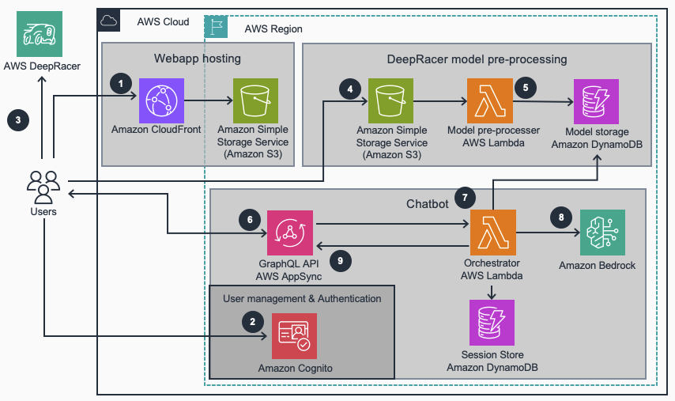

# Guidance for AWS DeepRacer chatbot

## Table of Contents

1. [Overview](#overview)
   - [Architecture](#architecture)
   - [Cost](#cost)
2. [Prerequisites](#prerequisites)
   - [Operating System](#operating-system)
3. [Deployment Steps](#deployment-steps)
4. [Deployment Validation](#deployment-validation)
5. [Running the Guidance](#running-the-guidance)
6. [Next Steps](#next-steps)
7. [Cleanup](#cleanup)
8. [FAQ, known issues, additional considerations, and limitations](#faq-known-issues-additional-considerations-and-limitations)
9. [Revisions](#revisions)
10. [Notices](#notices)
11. [Authors](#authors)

## Overview

This guidance provides a chatbot solution for AWS DeepRacer, allowing users to chat their way to deeper knowledge about AWS DeepRacer and how to improve their own DeepRacer models. The chatbot is a NextJS application with a Bedrock-powered serverless backend, and the infrastructure is managed via AWS CDK.

### Architecture



1. The users navigate to the Amazon CloudFront URL to fetch the DeepRacer Chatbot webapp.
2. The users authenticates with Amazon Cognito

3. The users export and download their trained DeepRacer models to their laptop and store as a zip file. See Import and export models in the AWS DeepRacer console for mode details on how to export your models

4. Upload the compressed model package to Amazon Simple Storage Service (Amazon S3).

5. When a new object is created in Amazon S3 a lambda is invoked to download and parse logs inside the compressed model. The result is stored in an Amazon DynamoDB table and the uploaded model is deleted from Amazon S3.
6. When a user ask a question about the model, the message is sent to Amazon Appsync with an AWS Lambda resolver.
7. The AWS Lambda function will fetch any previous conversation from the session store and update the prompt before forwarding the message to the Amazon Bedrock Converse stream API and use function calling to fetch the parsed model from Amazon DynamoDB.
8. The LLM in Amazon Bedrock will utilize the system prompt, model data and the user question to analyze the DeepRacer model.
9. The model response is streamed via the AWS Lambda and Appsync to the subscribed users

### Cost

You are responsible for the cost of the AWS services used while running this Guidance. As of September 2024, the cost for running this Guidance with the default settings in the US East (N.Virginia) region is approximately $12 per month for processing 1M/100K input/output tokens with Bedrock plus the supporting services required to run this Guidance.

We recommend creating a [Budget](https://docs.aws.amazon.com/cost-management/latest/userguide/budgets-managing-costs.html) through [AWS Cost Explorer](https://aws.amazon.com/aws-cost-management/aws-cost-explorer/) to help manage costs. Prices are subject to change. For full details, refer to the pricing webpage for each AWS service used in this Guidance.

### Sample Cost Table

| Service           | Monthly Cost |
| :---------------- | -----------: |
| Amazon Cognito    |        $0.50 |
| AWS AppSync       |        $1.54 |
| AWS Lambda        |        $0.08 |
| Amazon DynamoDB   |        $0.30 |
| Amazon S3         |        $0.03 |
| Amazon CloudFront |        $0.86 |
| Amazon CloudWatch |        $2.76 |
| Amazon Bedrock    |        $5.80 |
| Data Transfer     |        $0.09 |
| _Total_           |     _$11.96_ |

## Prerequisites

### Operating System

These deployment instructions are optimized to work best on MacOS or Linux. Deployment on Windows may require additional steps.

1. Install [Finch](https://github.com/runfinch/finch)
2. Install [AWS CLI](https://docs.aws.amazon.com/cli/latest/userguide/getting-started-install.html)
3. Install [Amplify CLI](https://docs.amplify.aws/gen1/javascript/tools/cli/start/set-up-cli/)
4. Install Node.js (version 18 or later)

### AWS account requirements

This guidance requires admin permissions for IAM to deploy all necessary resources.

Additionally, ensure that the following models are enabled in Amazon Bedrock in the region of deployment:

1. Titan Multimodal Embeddings G1
2. Claude 3.5 Sonnet

See [Amazon Bedrock documentation](https://docs.aws.amazon.com/bedrock/latest/userguide/model-access.html) for more details on enabling these models.

### Supported Regions

This deployment has been tested in us-east-1 (N.Virginia) and us-west-2 (Oregon) but is built to work in all AWS regions where Amazon Bedrock and the required models (Titan Multimodal Embeddings G1 and Claude 3 Sonnet) are available.

## Deployment Steps

1. Clone the repo:
   ```
   git clone <placeholder_url>
   ```
2. Change to the root of the project:
   ```
   cd <project_directory>
   ```
3. Install dependencies:
   ```
   npm install
   ```
4. Start Finch VM:
   ```
   finch vm start
   ```
5. Log in to your AWS account using the AWS CLI:

   a. If you haven't already configured your AWS CLI, run the following command and follow the prompts:

   ```
   aws configure
   ```

   You'll need to enter your AWS Access Key ID, Secret Access Key, default region name, and default output format.

   b. If you're using named profiles, you can switch to a specific profile using:

   ```
   export AWS_PROFILE=your-profile-name
   ```

   c. To verify that you're logged in and using the correct account, you can run:

   ```
   aws sts get-caller-identity
   ```

   This will display your account ID, user ID, and ARN.

For more detailed information on configuring and using the AWS CLI, refer to the following AWS documentation:

- [Configuring the AWS CLI](https://docs.aws.amazon.com/cli/latest/userguide/cli-configure-quickstart.html)
- [Using named profiles](https://docs.aws.amazon.com/cli/latest/userguide/cli-configure-profiles.html)
- [Setting environment variables](https://docs.aws.amazon.com/cli/latest/userguide/cli-configure-envvars.html)

If you're new to AWS CLI or need to install it, you can find installation instructions here:
[Installing or updating the latest version of the AWS CLI](https://docs.aws.amazon.com/cli/latest/userguide/getting-started-install.html)

6. Add your environment config to **cdk.json**. Example:

```json
    "dev-env01": {
      "AwsAccountId": "123456789012",
      "AwsRegion": "us-west-2",
      "BedrockRegion": "us-west-2",
      "AppName": "DeepracerModelEvaluator",
      "Environment": "dev"
    }
```

7. Run `make bootstrap config=<context>` (if the account/region isn't already bootstrapped)
8. Run `make all config=<context>`
9. From the deployment outputs, take note of the `WebsiteUserInterfaceDomainName`

## Deployment Validation

To validate the deployment:

1. Check the AWS CloudFormation console to ensure the stack has been created successfully.
2. Verify that all resources in the stack show a status of "CREATE_COMPLETE" (all green).
3. Run `make test config=<context>` to perform CDK-Nag checks.

## Running the Guidance

1. Register a new user to Cognito user pool inside the AWS Console
2. Add registered user to the "Users" group within the user pool
3. Visit the `WebsiteUserInterfaceDomainName` from deployment outputs
4. Login to the platform using the registered user
5. Follow guidance within help panels for each chatbot function

## Next Steps

After successfully deploying and running the AWS DeepRacer chatbot, you can consider the following steps to further enhance and customize the solution according to your specific requirements:

1. Update web interface to use custom branding
2. Create and test models in the AWS Console developed from the chatbot
3. Update chatbot chains within `/lib/bedrock-integration-resolver-py/function/chains` to change how the interface interacts with Amazon Bedrock

## Cleanup

To remove all resources created by this guidance, follow these steps:

1. Ensure you are in the project root directory.
2. Run the following command, replacing `<context>` with the appropriate context name used during deployment:
   ```
   make destroy config=<context>
   ```
3. Wait for the CloudFormation stack deletion to complete. You can monitor the progress in the AWS CloudFormation console.
4. Once the stack is deleted, verify in the AWS Console that all associated resources have been removed.

Note: If you have stored any data in resources created by this guidance (e.g., S3 buckets), you may need to manually delete this data before running the destroy command.

## FAQ, known issues, additional considerations, and limitations

Known issues and limitations:

- Amazon Bedrock has [usage quotas](https://docs.aws.amazon.com/bedrock/latest/userguide/quotas.html) (request per minute / tokens processed per minute) which for Anthropic Claude 3.5 Sonnet can be hit if multiple users are accessing the solution at the same time. Be aware of these limits, and for guaranteed throughput we recommend [Provisioned Throughput](https://docs.aws.amazon.com/bedrock/latest/userguide/prov-throughput.html)

## Revisions

| Version | Date     |
| ------- | -------- |
| 1.0     | DATE-TBC |

## Notices

Customers are responsible for making their own independent assessment of the information in this Guidance. This Guidance: (a) is for informational purposes only, (b) represents AWS current product offerings and practices, which are subject to change without notice, and (c) does not create any commitments or assurances from AWS and its affiliates, suppliers or licensors. AWS products or services are provided "as is" without warranties, representations, or conditions of any kind, whether express or implied. AWS responsibilities and liabilities to its customers are controlled by AWS agreements, and this Guidance is not part of, nor does it modify, any agreement between AWS and its customers.

## Authors

- Johan Esbjörner
- Steven Askwith
- Chris Scudder
- Anton Lukin
- Talha Chattha
